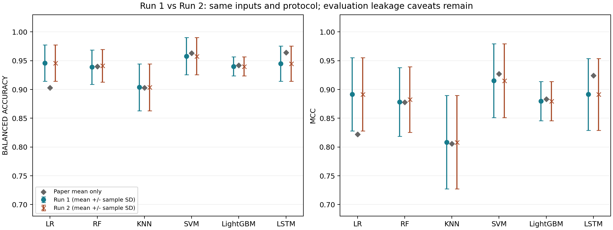
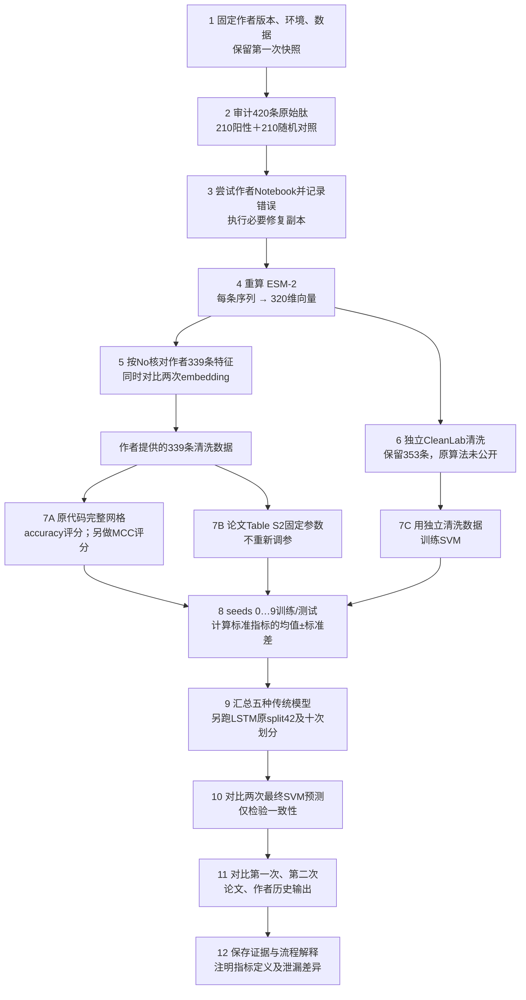
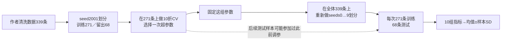

# 两次完整复现、论文与作者代码结果对照

第二次实际执行日期：2026-09-23。开始/结束时间：`2026-09-23T02:12:10.788287+00:00` / `2026-09-23T02:16:55.053841+00:00`（UTC）。第一次产物日期：2026-09-22，来源于已保存的原始复现实验，第二次从原始序列重新计算，未读取第一次训练结果作为答案。

## 核心结论

两次各有131条模型/划分评估记录，全部一一配对。数据和依赖版本一致；ESM逐位相同：**True**；CleanLab删除决策相同：**True**；训练/测试成员相同：**True**。标准指标出现超过1e-12变化的实验/模型：**A｜作者数据＋代码网格 / RF**。

SVM A方案两次标准BACC均值分别为0.957879、0.957879，MCC分别0.915383、0.915383。最终部署SVM对同一420条序列的分类差异为0条，最大decision score差异0。这项检查衡量两模型行为一致性，不能作为新的独立测试成绩。

科学复现结论仍为 **C. Partially reproduced**：重复运行稳定与论文严格复现成功是两回事。作者CleanLab源程序/环境未公开，存储Notebook数据版本不同，指标命名和调参评分不一致，而且原设计存在评估泄漏风险。

## 1. 先认清四种对照对象

1. **第一次、第二次重跑**：相同当前公开数据、相同环境、相同代码和参数协议，可逐seed配对比较。
2. **作者Notebook保存输出**：历史结果；其中展示过343条数据，当前清洗文件339条。不是作者训练权重，也不是我们本次运行得到的结果。
3. **论文正文/Table S2数值**：论文声称的结果。Table S2标题写10折CV，正文说十次随机划分，语义有歧义。
4. **F：按论文固定参数重跑**：采用S2给出的参数，在当前339条数据上按公开seeds0…9评估。没有为了追近论文结果再调参。

主仓库未提供原始训练权重，因此无法将作者原权重和本次模型逐权重比较。提供的原始文件是公开数据、Notebook和评估helper。

## 2. 全部模型：两次结果与原结果

均值±标准差是**每次运行内十个划分**的样本标准差（ddof=1），不是“第一次和第二次之间的标准差”。MCC变化=第二次均值−第一次均值。五个传统模型使用A方案，LSTM使用E方案的十次独立划分；作者保存的LSTM MCC只有split42单次，不能把它当作十次均值。

| 模型 | 第一次 BACC | 第二次 BACC | 第一次 MCC | 第二次 MCC | MCC 均值变化 | 作者保存 MCC | 论文 MCC |
| --- | --- | --- | --- | --- | --- | --- | --- |
| LR | 0.945768 ± 0.031640 | 0.945768 ± 0.031640 | 0.891606 ± 0.063792 | 0.891606 ± 0.063792 | 0.000000 | 0.886000 ± 0.036000 | 0.822000 ± 0.172000 |
| RF | 0.938819 ± 0.029979 | 0.941367 ± 0.028287 | 0.878380 ± 0.059756 | 0.882594 ± 0.056957 | 0.004214 | 0.508000 ± 0.068000 | 0.878000 ± 0.052000 |
| KNN | 0.903787 ± 0.040801 | 0.903787 ± 0.040801 | 0.808373 ± 0.081209 | 0.808373 ± 0.081209 | 0.000000 | 0.522000 ± 0.056000 | 0.806000 ± 0.074000 |
| SVM | 0.957879 ± 0.032325 | 0.957879 ± 0.032325 | 0.915383 ± 0.064257 | 0.915383 ± 0.064257 | 0.000000 | 0.550000 ± 0.072000 | 0.927000 ± 0.044000 |
| LightGBM | 0.940019 ± 0.016558 | 0.940019 ± 0.016558 | 0.879725 ± 0.034129 | 0.879725 ± 0.034129 | 0.000000 | 0.572000 ± 0.065000 | 0.883000 ± 0.034000 |
| LSTM | 0.945040 ± 0.030595 | 0.945040 ± 0.030595 | 0.891444 ± 0.062443 | 0.891444 ± 0.062443 | 0.000000 | 0.494508（单次） | 0.924000 ± 0.029000 |

图中误差条为各次运行内十个划分的样本标准差；论文仅显示均值。

作者保存MCC与当前结果的差异不能只归因于随机性：输入版本、超参数和环境都有差异。其BACC/Recall/Precision还存在定义错误，因此没有把这些历史打印值直接混进本表的标准BACC列。完整同公式比较见 `author_same_formula_comparison.csv`；所有九项标准指标及131对逐seed差值见 `paired_seed_results.csv`。

## 3. 第二次有没有改变参数或选种子？

没有。原始网格、评分、初始化约定、划分种子和CleanLab规则保持不变。只对第二次副本的common.py改动两行路径设置，以独立保存输出；diff与逐脚本SHA在第二次logs中。作者原始文件没有修改，第一次快照的170项文件SHA全部通过验证。

| model | run1_parameters | run2_parameters | parameters_equal | run1_cv_accuracy | run2_cv_accuracy |
| --- | --- | --- | --- | --- | --- |
| LR | {"C": 6} | {"C": 6} | True | 0.944577 | 0.944577 |
| RF | {"max_depth": 5, "max_features": "log2", "n_estimators": 320} | {"max_depth": 4, "max_features": "sqrt", "n_estimators": 480} | False | 0.941005 | 0.940873 |
| KNN | {"algorithm": "auto", "leaf_size": 10, "n_neighbors": 2, "weights": "distance"} | {"algorithm": "auto", "leaf_size": 10, "n_neighbors": 2, "weights": "distance"} | True | 0.922354 | 0.922354 |
| SVM | {"C": 30, "degree": 5, "kernel": "poly", "tol": 1e-05} | {"C": 30, "degree": 5, "kernel": "poly", "tol": 1e-05} | True | 0.951984 | 0.951984 |
| LightGBM | {"learning_rate": 1, "max_depth": -1, "n_estimators": 40, "reg_lambda": 0} | {"learning_rate": 1, "max_depth": -1, "n_estimators": 40, "reg_lambda": 0} | True | 0.952116 | 0.952116 |

随机森林原网格始终保留 `random_state=None`。它的首次/第二次最佳参数分别为 `{"max_depth": 5, "max_features": "log2", "n_estimators": 320}` / `{"max_depth": 4, "max_features": "sqrt", "n_estimators": 480}`。这种设置允许并行CV及重新fit产生随机波动；设置numpy全局seed并不等价于为每个RF estimator固定随机状态。与之相对，F论文固定参数独立实验里的RF显式设random_state=0。两种协议没有混在一起，也未用更好的一次替换较差的一次。

## 4. SVM四条实验路线

| 方案 | 第一次 BACC | 第二次 BACC | 第一次 MCC | 第二次 MCC | 第二次 Recall | 第二次 Precision |
| --- | --- | --- | --- | --- | --- | --- |
| A｜作者数据＋代码网格 | 0.957879 ± 0.032325 | 0.957879 ± 0.032325 | 0.915383 ± 0.064257 | 0.915383 ± 0.064257 | 0.952942 ± 0.035016 | 0.961555 ± 0.043597 |
| B｜作者数据＋MCC网格 | 0.957879 ± 0.032325 | 0.957879 ± 0.032325 | 0.915383 ± 0.064257 | 0.915383 ± 0.064257 | 0.952942 ± 0.035016 | 0.961555 ± 0.043597 |
| C｜重新编码＋独立清洗 | 0.952967 ± 0.019189 | 0.952967 ± 0.019189 | 0.905318 ± 0.039481 | 0.905318 ± 0.039481 | 0.970168 ± 0.023643 | 0.932172 ± 0.042038 |
| F｜论文固定参数 | 0.930126 ± 0.031354 | 0.930126 ± 0.031354 | 0.859924 ± 0.061380 | 0.859924 ± 0.061380 | 0.932007 ± 0.051054 | 0.925845 ± 0.038891 |

论文SVM：BACC=0.963±0.022、Recall=0.976±0.024、Precision=0.951±0.030、MCC=0.927±0.044。第二次A方案标准BACC与论文均值相差-0.005121，MCC相差-0.011617。第二次F方案BACC=0.930126、MCC=0.859924，分别与论文相差-0.032874、-0.067076。

- A：公开339条清洗特征＋源码的accuracy评分网格，SVM为C=30、poly、degree=5、tol=1e-5。
- B：仅把A的网格评分改为MCC；当前选择相同参数，并非两套不同最终模型。
- C：420条序列重新编码＋独立CleanLab保留353条，之后重新网格训练；不是作者缺失清洗代码的精确重跑。
- F：论文固定C=10、poly、degree=1、tol=1e-5；不重新选择参数。
- 作者Notebook保存的SVM为C=30、rbf、degree=1，MCC打印0.550±0.072；它与上述各路线的参数/数据并不相同。

## 5. 总流程图

## 6. 按步骤解释：输入什么、做什么、得到什么

| 步骤 | 名称 | 目的 | 本次执行 | 理解要点 |
| --- | --- | --- | --- | --- |
| 1 | 固定输入与环境 | 保证第二次是可比较的重复执行 | 同一作者 commit、Python、依赖、数据；第一次170项产物快照校验通过 | 仅改两行输出路径；未改算法/网格/阈值 |
| 2 | 审计原始数据 | 检查模型到底学习什么 | 420条：210阳性＋210随机对照；作者清洗后339条：161＋178 | 随机对照不等于实验验证无活性 |
| 3 | 执行作者 Notebook | 验证原始代码能否直接运行 | 原样失败；路径修复后ESM成功、训练Notebook在X_out处中断；保留错误 | 实际训练用原Notebook提取的完整网格和必要兼容修复 |
| 4 | 重新计算 ESM-2 | 把不同长度序列转换为定长特征 | esm2_t6_8M_UR50D，第6层，残基均值池化，420×320；本次重新前向计算 | 只复用预训练权重缓存，没有跳过embedding计算 |
| 5 | 核对作者特征 | 确认编码和样本顺序 | 339条公开向量按No与原始序列连接；分别与两次重算向量比较 | 两次一致与作者一致是两种不同检验 |
| 6 | 重新做 CleanLab | 识别疑似标签问题 | LR＋5折OOF概率＋默认过滤；两次保留353/353条 | 作者清洗实现缺失；353条是独立重建，不是严格复现339 |
| 7 | 划分与网格搜索 | 在训练部分比较超参数 | 先seed2001做80/20划分；271条训练做10折网格，68条初始留出 | 原源码scoring默认accuracy；另做MCC评分作为B实验 |
| 8 | 重复训练与评估 | 衡量对划分的敏感程度 | 固定选出的参数，用seeds0…9再训练/测试；标准差ddof=1 | 并非挑最好seed；后续测试集与此前调参数据有重叠 |
| 9 | 复现其他模型 | 确认现象是否只存在于SVM | LR、RF、KNN、SVM、LightGBM完整网格；LSTM原split42＋十次独立划分 | RF random_state=None原样保留；LSTM只作Keras标签维度兼容修复 |
| 10 | 比较模型产物 | 判断两次预测行为是否改变 | 最终SVM分别在全部339条上refit，再对同一420条作一致性检查 | 这420条不是新的独立测试集，只用于诊断两模型差别 |
| 11 | 对比论文和作者输出 | 分清数值差异与定义差异 | 同时保留论文S2、作者Notebook历史输出、两次重跑和论文固定参数实验 | 原权重未公开；保存输出至少展示343条，与当前339条不一致 |
| 12 | 保存证据与解释 | 让每个结论可追溯 | 两次完整目录＋逐seed指标差＋参数差＋流程图＋哈希 | 稳定重复不消除原设计泄漏，也不证明生物学有效性 |

**ESM为什么有320维？** 每条肽有若干氨基酸。模型第6层给每个残基一个320维表示；沿残基方向求平均，把不同长度的肽变成同样长度的320维向量。BOS、EOS、padding不参与均值；不做额外归一化。这个过程使用预训练模型，不是用420条数据重新训练ESM。

**CleanLab到底做了什么？** 先让LR对每条肽给出“在未见过该条训练数据的CV模型下”的预测概率，再结合现有标签识别可疑样本。主重建固定5折、seed0、max_iter5000和默认过滤，不反复试阈值。两次都保留353条，和作者339条的保留集合重叠333条，420条保留/删除决策一致率93.81%。数量一致本身不足以证明算法一致；这里连数量也不等，且作者源码缺失。

**什么叫重新跑一遍？** 第二次重新执行了Notebook尝试、ESM前向推理、CV预测概率、CleanLab决策、全部网格和LSTM训练、最终模型保存及验证。仅复用已有ESM预训练权重缓存；没有复用第一次的embedding文件、清洗mask或已训练分类器。

## 7. 训练步骤与泄漏为什么必须分开看

原方法先用完整数据清洗，再划分；样本保留决策已使用测试标签信息。然后先选一次超参数，再把全体339条重新划分十次，使后续测试集有52–64/68条参加过此前调参。原helper还反复fit同一个estimator，导致Notebook随后打印的初始留出成绩使用了被重新训练过的模型。

重复划分无完全重复肽，但每次68条测试肽中有12–17条与训练肽的normalized Levenshtein similarity>0.8。相似度定义为1−编辑距离/max长度；审计使用严格大于号，不把等于0.9计为>0.9。

本次继续原设计以检验重复性，没有悄悄改成无泄漏方案。两次分数相同不会修复上述问题，也不能据此证明真实外部泛化或肽的生物学功效。

## 8. 为什么我报告的指标与作者打印值不能直接对号？

标准二分类矩阵为 `[[TN,FP],[FN,TP]]`；作者代码按`TP,FP,FN,TN`接收，交换了TN和TP的名称。

| 指标 | 本次标准定义 | 作者helper实际计算 | 比较限制 |
| --- | --- | --- | --- |
| BACC | (正类召回率＋负类召回率)/2 | (NPV＋PPV)/2，即macro precision | 不能直接当作同一定义比较 |
| Recall | TP/(TP+FN) | TN/(TN+FN)，即NPV | 作者打印值不是正类召回率 |
| Precision | TP/(TP+FP) | TN/(TN+FP)，即specificity | 作者打印值不是正类精确率 |
| F1 | 2TP/(2TP+FP+FN) | 2TN/(2TN+FP+FN)，即负类F1 | 正负类不同 |
| MCC | [-1,1]，综合四格统计 | TP/TN名称交换不改变该公式值 | 公式可比，但数据版本/划分仍不同 |
| ROC-AUC | 连续得分区分正负类的能力 | 使用decision_function或正类概率 | 公式可比，但数据版本/划分仍不同 |

BACC标准含义是“对正例、负例各给一半权重的识别率”；Recall是有活性标签的肽中找回多少；Precision是判为阳性的肽中真阳性标签占多少；MCC综合考虑四种预测结果，1为完全一致，0附近表示相关性弱，负值表示反向关联。

## 9. 证据、边界和复跑入口

| component | run1 | run2 | equal |
| --- | --- | --- | --- |
| torch | 2.6.0 | 2.6.0 | True |
| fair-esm | 2.0.0 | 2.0.0 | True |
| scikit-learn | 1.5.2 | 1.5.2 | True |
| cleanlab | 2.7.0 | 2.7.0 | True |
| numpy | 1.26.4 | 1.26.4 | True |
| pandas | 2.2.3 | 2.2.3 | True |
| lightgbm | 4.6.0 | 4.6.0 | True |
| tensorflow | 2.18.0 | 2.18.0 | True |
| keras | 3.15.1 | 3.15.1 | True |
| scipy | 1.14.1 | 1.14.1 | True |
| nbclient | 0.11.0 | 0.11.0 | True |
| python | 3.12.14 | 3.12.14 | True |
| os | macOS-26.6-arm64-arm-64bit | macOS-26.6-arm64-arm-64bit | True |
| architecture | arm64 | arm64 | True |

- 原始作者输入完整性：`input_integrity.csv`。
- 完整逐seed配对：`paired_seed_results.csv`，126组实验/模型/标准指标汇总：`model_repeatability_summary.csv`。
- 每个网格候选的两次得分：`paired_grid_scores.csv`；最佳参数：`selected_parameters_comparison.csv`。
- 420条embedding/清洗决策配对：`embedding_cleanlab_paired_samples.csv`。
- 作者原打印定义对比：`author_same_formula_comparison.csv`；论文与两次结果：`paper_vs_both_runs.csv`。
- 两个最终SVM的预测诊断：`svm_prediction_agreement_420.csv`。
- 第一次目录：`../../runs/run_01_2026-09-22/`；第二次目录：`../../runs/run_02_2026-09-23/`。
- 本报告及流程图由 `reproduction/src/compare_runs.py` 从实际结果生成，执行 `.venv/bin/python reproduction/src/compare_runs.py` 可以重新生成对比，不会重训模型。

两次运行不构成统计显著性检验；十个测试划分也互有重叠。这里报告实际差值和逐seed一致性，不计算误导性的独立样本p值。RF随机性保留是忠实于原代码的选择，并非遗漏其风险。未公开的原训练权重与CleanLab源码仍是严格科学复现的缺口。
